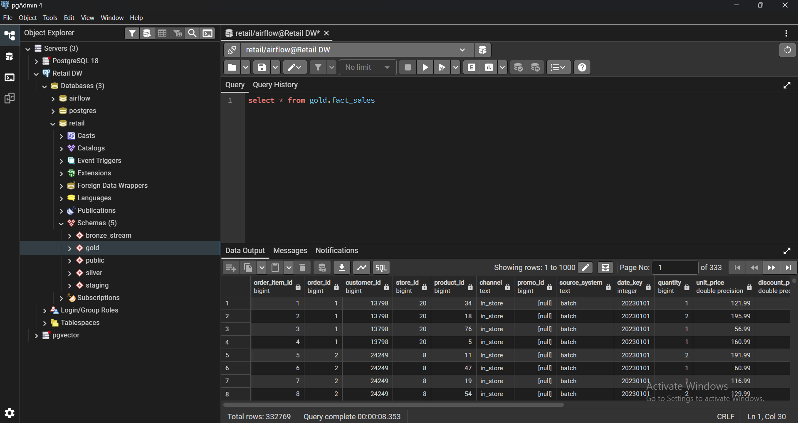
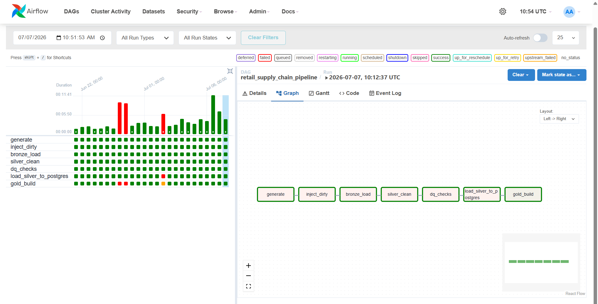
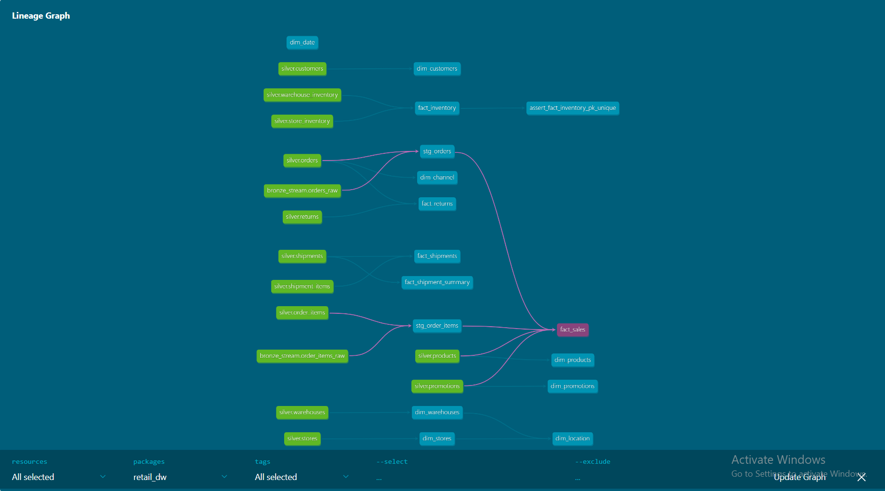
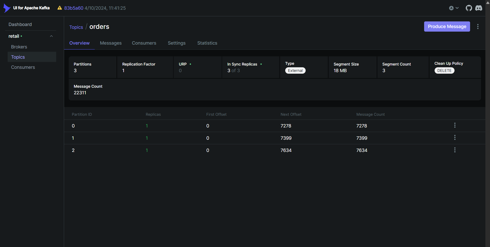
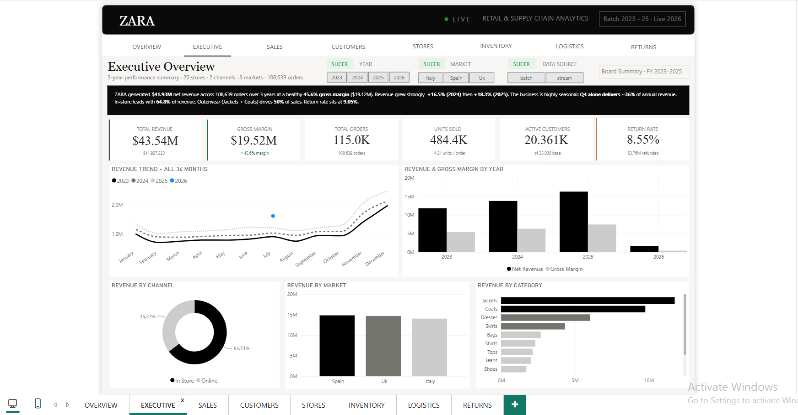

# Smart Retail Supply Chain Data Platform

An end-to-end data platform for a fashion retailer (ZARA-style), combining a **batch** Medallion
pipeline with a **real-time streaming** ingestion layer. Raw operational data is generated, cleaned,
quality-checked, modeled into a governed star schema, and served to Power BI dashboards, with live
orders flowing in through Apache Kafka.

Built to demonstrate production data-engineering practice: orchestration, data quality, dimensional
modeling with automated tests, and stream/batch unification.


---

## Tech Stack

| Layer | Tools |
|---|---|
| Orchestration | Apache Airflow |
| Streaming | Apache Kafka (KRaft) |
| Transformation / Modeling | dbt (dbt-postgres) |
| Warehouse | PostgreSQL |
| Processing | Python, pandas, Faker |
| Analytics | Power BI |
| ML | XGBoost (order quantity prediction) |
| Runtime | Docker Compose |

---

## Data Layers (Medallion)

- **Bronze**: raw generated data, intentionally dirtied to simulate real ingestion.
- **Silver**: cleaned, validated, per-entity tables (customers, orders, products, stores,
  shipments, returns, inventory, and more).
- **Gold**: dbt-managed **star schema**, 8 dimensions + 5 fact tables, covered by **71 automated
  data-quality tests** (uniqueness, not-null, referential integrity, accepted values).

Live orders land in a separate `bronze_stream` schema and are unioned into `fact_sales` through dbt
staging views, tagged with a `source_system` flag (`batch` / `stream`) so BI can slice historical
vs live.

The layered schemas in Postgres, `bronze_stream`, `silver`, `gold`, `staging`:



---

## Pipeline (Airflow DAG)

```
generate -> inject_dirty -> bronze_load -> silver_clean -> dq_checks -> load_to_postgres -> gold_build (dbt)
```

`gold_build` runs `dbt build`, which materializes the star schema **and** runs every test in one step.



The Gold star schema and its lineage, as built by dbt:



---

## Real-Time Streaming (Kafka)

- **Producer** simulates realistic live orders from Silver reference data (weighted customers,
  seasonal product mix, active promotions) and publishes to the `orders` topic.
- **Consumer** reads the topic and lands events into `bronze_stream.*` in Postgres with
  **at-least-once** delivery (offsets committed only after a successful write).
- dbt staging views UNION batch + stream, so re-running `dbt build` folds live orders into Gold.

Live order events flowing through the Kafka `orders` topic:



After a rebuild, `fact_sales` carries both sources side by side, historical batch and live stream:


---

## Quick Start

```bash
docker compose up -d          # start the full stack
```

Then trigger the `retail_supply_chain_pipeline` DAG in Airflow to build the warehouse.

| Service | URL |
|---|---|
| Airflow | http://localhost:8080 |
| Kafka UI | http://localhost:8081 |
| Postgres | localhost:5433 (db `retail`) |

**Batch only:** `docker compose up -d postgres airflow-webserver airflow-scheduler`
**Add streaming:** `docker compose up -d kafka kafka-ui order-producer order-consumer`, wait for orders
to land, then re-run the DAG and refresh Power BI.

---

## Project Structure

```
dags/           Airflow DAG (batch orchestration)
src/
  Bronze/       data generation + raw load
  Silver/       per-table cleaning
  pipelines/    silver runner + Postgres loader
  quality/      data-quality checks
  streaming/    Kafka producer + consumer
dbt/
  models/gold/      star schema (dims + facts)
  models/staging/   batch + stream UNION views
  macros/ tests/    schema logic + data tests
docker/         Postgres init + streaming Dockerfile
notebooks/      ML: order quantity prediction (XGBoost)
powerbi/        Power BI dashboard (.pbix)
```

---

## Analytics & ML

- **Power BI**: executive, sales, customer, store, inventory, logistics and returns pages, with a
  Data Source slicer to compare **live vs historical** sales.
- **ML**: an XGBoost model predicting order quantity from customer, product and seasonal features.


